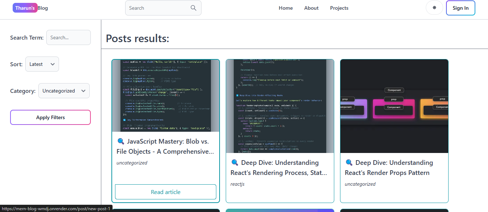
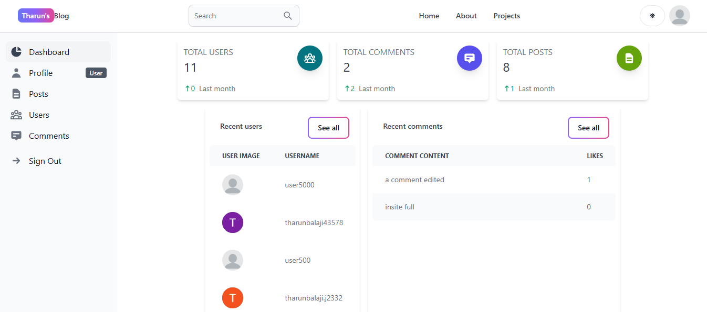

# Blog App

## Overview

This is a MERN stack blog application that allows users to create accounts, view blog posts, and comment on them. Admins have the ability to create, edit, and delete blog posts, as well as manage user comments.

## Key Features

1. **User Authentication**:
   - Users can sign up, sign in, and sign out.
   - Users can sign in using Google OAuth.
   - Admins can access the dashboard and perform CRUD operations on blog posts.

2. **Blog Post Management**:
   - Admins can create, update, and delete blog posts.
   - Blog posts can include images, which are stored using Firebase.
   - Users can view blog posts and filter/sort them by category and date.

3. **Comment Management**:
   - Users can comment on blog posts and like comments.
   - Users can edit and delete their own comments.
   - Admins can view and manage all comments.

4. **Theming**:
   - Users can switch between dark and light themes.

5. **Responsive Design**:
   - The application is designed to be mobile-friendly and responsive.

6. **State Management**:
   - Redux is used for complex state management, and Redux Persist is used for caching.

7. **Routing**:
   - React Router DOM is used for managing routes, including private routes for admins.

8. **Backend**:
   - Express is used for the web server.
   - MongoDB is used as the database, with Mongoose as the ORM.
   - Morgan is used for logging, and bcrypt and JWT are used for authentication and authorization.


## 🔗 Live Demo

[MERN BLog App](https://chat-app-xflo.onrender.com/)


## 🖼️ Preview

### Home Page


### Recent Posts


### All Posts


### About Page


### Projects Page


### Sign In Page


### Sign Up Page


### Dashboard


### Dashboard Profile Page


### Dashboard Posts Page


### Dashboard Users Page


### Dashboard Comments Page


### Update Post Page


### Delete Post


### Read Post


### Create Post


## Routes

### Client-side Routes

- `/`: Home page
- `/about`: About page
- `/sign-in`: Sign-in page
- `/sign-up`: Sign-up page
- `/search`: Search page
- `/dashboard`: Dashboard (requires authentication)
- `/create-post`: Create post (requires admin authentication)
- `/update-post/:postId`: Update post (requires admin authentication)
- `/projects`: Projects page
- `/post/:postSlug`: Individual post page

### Server-side Routes

#### Auth Routes

- `POST /api/auth/signup`: Sign up a new user
- `POST /api/auth/signin`: Sign in a user
- `POST /api/auth/google`: Sign in a user using Google OAuth

#### Comment Routes

- `POST /api/comments/create`: Create a new comment (requires authentication)
- `GET /api/comments/getPostComments/:postId`: Get comments for a specific post
- `PUT /api/comments/likeComment/:commentId`: Like a comment (requires authentication)
- `PUT /api/comments/editComment/:commentId`: Edit a comment (requires authentication)
- `DELETE /api/comments/deleteComment/:commentId`: Delete a comment (requires authentication)
- `GET /api/comments/getcomments`: Get all comments (requires authentication)

#### Post Routes

- `POST /api/posts/create`: Create a new post (requires authentication)
- `GET /api/posts/getposts`: Get all posts
- `DELETE /api/posts/deletepost/:postId/:userId`: Delete a post (requires authentication)
- `PUT /api/posts/updatepost/:postId/:userId`: Update a post (requires authentication)

#### User Routes

- `PUT /api/users/update/:userId`: Update a user's information (requires authentication)
- `DELETE /api/users/delete/:userId`: Delete a user (requires authentication)
- `POST /api/users/signout`: Sign out a user
- `GET /api/users/getusers`: Get all users (requires authentication)
- `GET /api/users/:userId`: Get a user's information

## Schemas

### Comment Schema

```javascript
commentSchema = new mongoose.Schema(
  {
    content: {
      type: String,
      required: true,
    },
    postId: {
      type: String,
      required: true,
    },
    userId: {
      type: String,
      required: true,
    },
    likes: {
      type: Array,
      default: [],
    },
    numberOfLikes: {
      type: Number,
      default: 0,
    },
  },
  { timestamps: true }
);
```

### Post Schema

```javascript
postSchema = new mongoose.Schema(
  {
    userId: {
      type: String,
      required: true,
    },
    content: {
      type: String,
      required: true,
    },
    title: {
      type: String,
      required: true,
      unique: true,
    },
    image: {
      type: String,
      default:
        'https://www.hostinger.com/tutorials/wp-content/uploads/sites/2/2021/09/how-to-write-a-blog-post.png',
    },
    category: {
      type: String,
      default: 'uncategorized',
    },
    slug: {
      type: String,
      required: true,
      unique: true,
    },
  },
  { timestamps: true }
);
```

### User Schema

```javascript
userSchema = new mongoose.Schema({
  username: {
    type: String,
    required: true,
    unique: true
  },
  email: {
    type: String,
    required: true,
    unique: true
  },
  password: {
    type: String,
    required: true
  },
  profilePicture: {
    type: String,
    default:
      'https://cdn.pixabay.com/photo/2015/10/05/22/37/blank-profile-picture-973460_960_720.png',
  },
  isAdmin: {
    type: Boolean,
    default: false
  }
}, {
  timestamps: true
});
```

## Client-side Routes

The client-side routes are managed using React Router DOM:

```javascript
<BrowserRouter>
  <ScrollToTop />
  <Header />
  <Routes>
    <Route path="/" element={<Home />} />
    <Route path="/about" element={<About />} />
    <Route path="/sign-in" element={<SignIn />} />
    <Route path="/sign-up" element={<SignUp />} />
    <Route path="/search" element={<Search />} />
    <Route element={<PrivateRoute />}>
      <Route path="/dashboard" element={<DashBoard />} />
    </Route>
    <Route element={<OnlyAdminPrivateRoute />}>
      <Route path="/create-post" element={<CreatePost />} />
      <Route path="/update-post/:postId" element={<UpdatePost />} />
    </Route>
    <Route path="/projects" element={<Projects />} />
    <Route path="/post/:postSlug" element={<PostPage />} />
  </Routes>
  <Footer />
</BrowserRouter>
```

## Technologies Used

- **Frontend**: React, Redux, React Router DOM, React Quill, React Icons, Flowbite, Tailwind CSS
- **Backend**: Express, MongoDB, Mongoose, Morgan, bcrypt, JWT
- **Deployment**: Firebase (for hosting and image storage)

## Getting Started

1. Clone the repository: `git clone https://github.com/Tharun-Balaji/mern-blog.git`
2. Install dependencies:
   - Frontend: `cd client && npm install`
   - Backend: `cd server && npm install`
3. Set up environment variables:
   - Create a `.env` file in the `server` directory and add the necessary environment variables (e.g., MongoDB connection string, JWT secret, Firebase credentials).
4. Start the development servers:
   - Frontend: `cd client && npm start`
   - Backend: `cd server && npm start`
5. Open the application in your browser at `http://localhost:3000`.

## Contributing

If you would like to contribute to the project, please follow these steps:

1. Fork the repository.
2. Create a new branch for your feature or bug fix: `git checkout -b feature/your-feature-name`.
3. Commit your changes: `git commit -m 'Add some feature'`.
4. Push to the branch: `git push origin feature/your-feature-name`.
5. Submit a pull request.

## License

This project is licensed under the [MIT License](LICENSE.md).